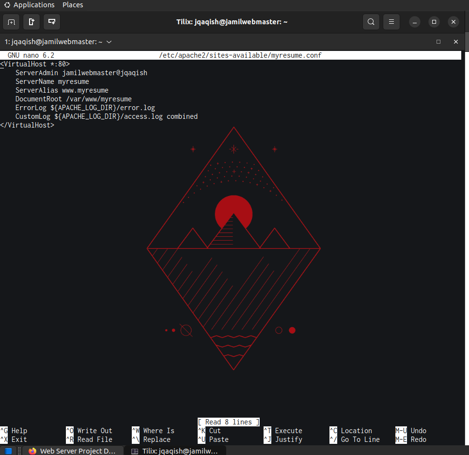

# Deliverable 2

## VM Config
These are the specs of the VM for the Ubuntu Server

Screen after logging into the Server

## Command Screenshots

The last 10 lines of Apache access log

Last 10 lines of Apache error log

Las 10 lines of SSH auth.log

Site config file

Apache2 conf file

Website Access

