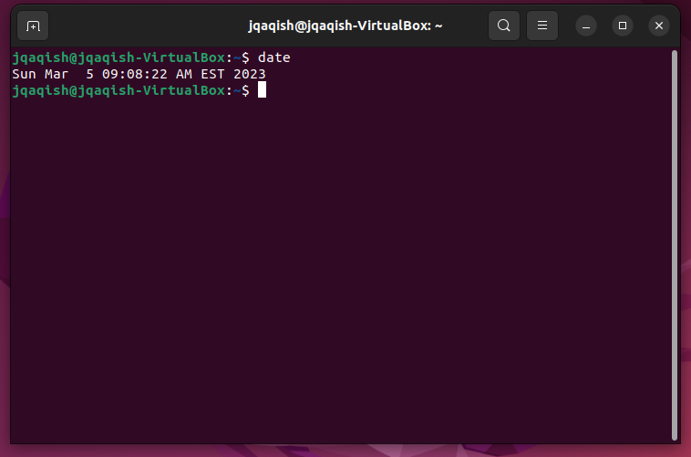
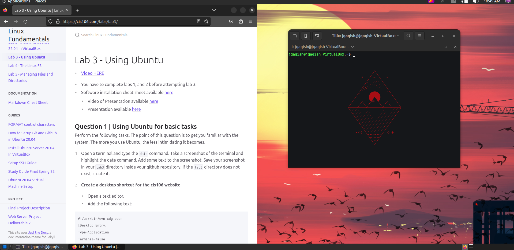

# Lab 3 Submission

## Question 1

## Question 2

## Question 3

| Program purpose     | Package Name     | Version                             |
| ------------------- | ---------------- | ----------------------------------- |
| Play a tetris game  | blockattack      | (2.7.0-1)                           |
| Play a video file   | dragonplayer     | (4:21.12.3-0ubuntu1)                |
| Browse the internet | epiphany-browser | (42.4-0ubuntu1)                     |
| Read your email     | thunderbird      | (1:102.7.1+build2-0ubuntu0.22.04.1) |
| Play music          | juk              | (4:21.12.3-0ubuntu1)                |

## Question 4

 | command | what it does                                        |
 | ------- | --------------------------------------------------- |
 | echo    | displays the sentence                               |
 | fortune | tells a fortune                                     |
 | cowsay  | says a quote with a cow picture                     |
 | lolcat  | turns text rainbow colored                          |
 | figlet  | displays sentence in big font                       |
 | toilet  | displays poem in toilet font                        |
 | rig     | gives random address text inside the shape of a man |
