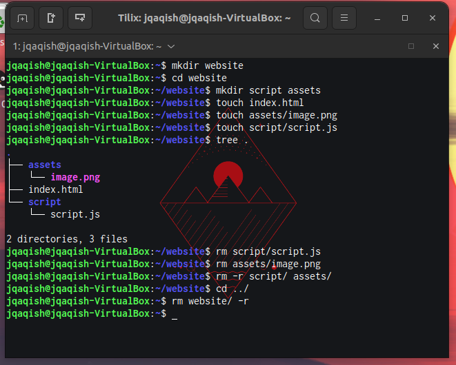
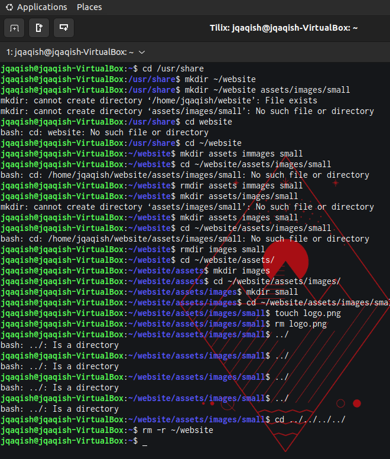
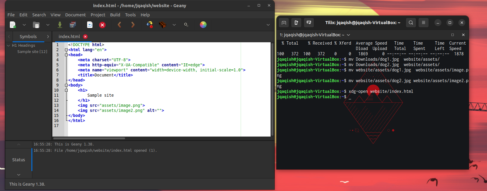
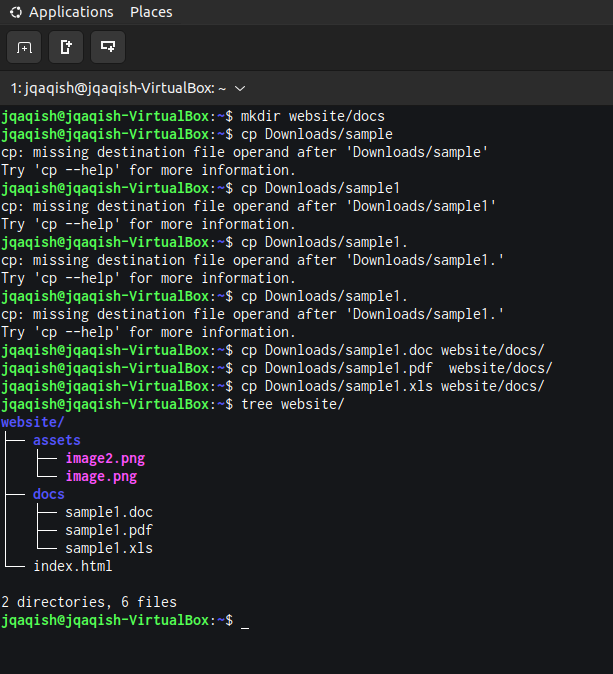

# Week Report 5

## Answers for questions:

* **What are Command Options?**
  A command option is a set of characters or words that follow a command.
* **What are Command Arguments?**
  They are parameters that are given on the system's command line and are passed on to your program during execution.
* **Which command is used for creating directories? Provide at least 3 examples.**
    The mkdir command is used to create directories.
    * ex 1:
      * Create: mkdir fruits
    * ex 2:
      * Create multiple directories: mkdir games ~/Downloads/GBA ~/Downloads/Gamecube
* **What does the touch command do? Provide at least 3 examples.**
  The touch command can:
   * create multiple files
     * ex 1: touch action adventure drama
   * set timestamp
     * ex 2: touch -t birthday
   * set file timestamps with dates
     * ex 3: touch -d 28 March 2023
* **How do you remove a file? Provide an example.**
    Use the rm command with the file's name.
    * ex 1: rm vacation pics
* **How do you remove a directory and can you remove non-empty directories in Linux? Provide an example**
    You can remove a directory with the rmdir command.
    * ex 1: rmdir screenshots
    Non-empty directories can be removed with the rm -r command.
    ex 2: rm -r CameraRoll
* **Explain the mv and cp command. Provide at least 2 examples of each**
    The mv command can
    move files or directories
    * ex: mv dog.png ~/Pictures
    rename files or directories
    * ex: mv dog.png ~/Pictures/ChocoLab.png
    The cp command can
    copy a file
    * ex: cp ~/Pictures/Chocolab.png ~/Pictures/dogs
    copy a directory
    * ex: cp -R ~/Downloads/games ~/Games/

## Practice 1

## Practice 2

## Practice 3

## Practice 4

