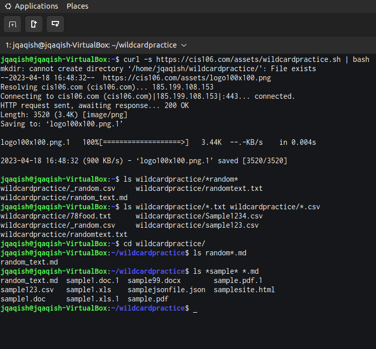
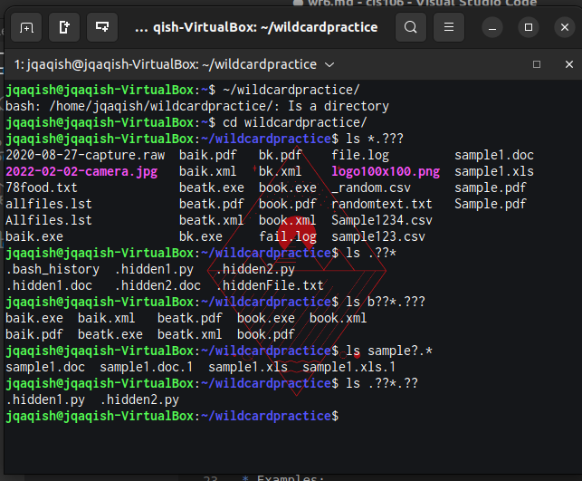
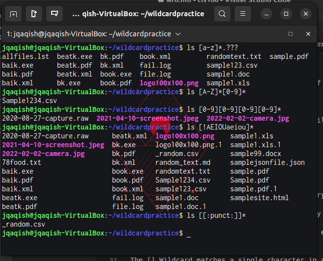

# Week Report 6

## Wildcards

### * Wildcard
The * Wildcard matches from 0 to any number of characters.
* Examples:
  * List all text files in a directory
    * `ls *.txt`
  * List all files that start with the word File
    * `ls file*`
  * Copy all the mp4 files
    * `cp Downloads/*.mp4 ~/Videos/Movies/`

### ? Wildcard
The ? Wildcard matches a single character.
* Examples:
  * Lists all hidden files in current directory
    * `ls ./.??*`
  * Lists all hidden files in parent directory
    * `ls ../.??*`
  * Lists all files that have a 3 letter file extension
    * `*.???`
### [] Wildcard
The [] Wildcard matches a single character in a range.
* Examples
  * Match all files that have a vowel after the letter f
    * `ls f[aeiou]*`
  * Match files that do not have vowels after the letter f
    * `ls f[!aeiou]*`
  * Match all files that have a range of letters after f
    * `ls f[a-z]*`

### Brace Expansion
Brace expansion {} is not a wildcard but another feature of bash that allows you to generate arbitrary strings to use with commands.
* Examples
  * Create a whole directory structure in a single command
    * `mkdir -p music/{jazz,rock}/{mp3files,videos,oggfiles}/new{1..3}`
  * Create a N number of files used
    * `touch website{1..5}.html`
  * Remove multiple files in a single command
    * `rm -r {dir1,dir2,dir3,file.txt,file.py}`

## Practice

