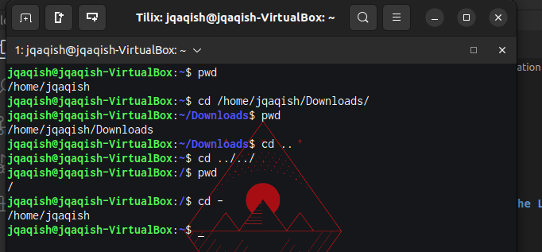
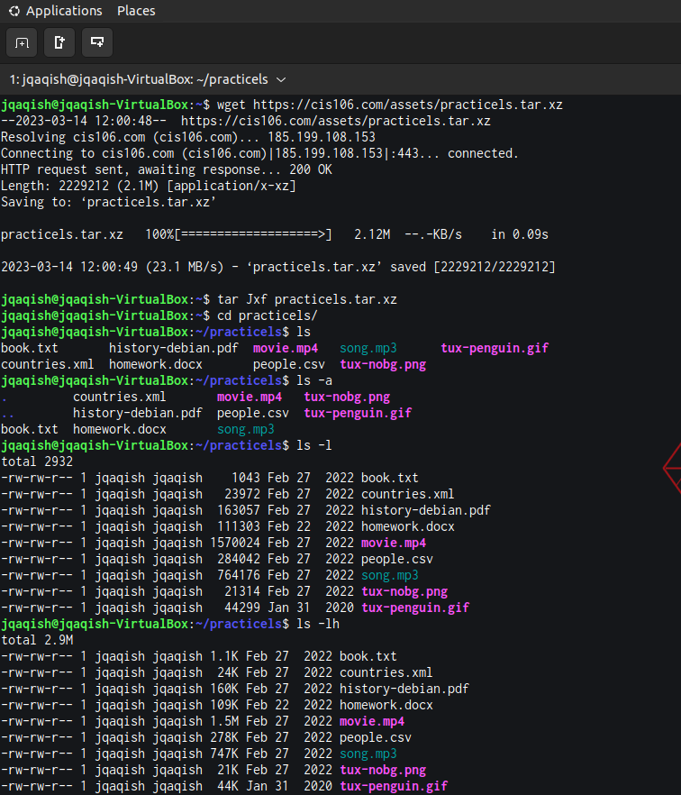
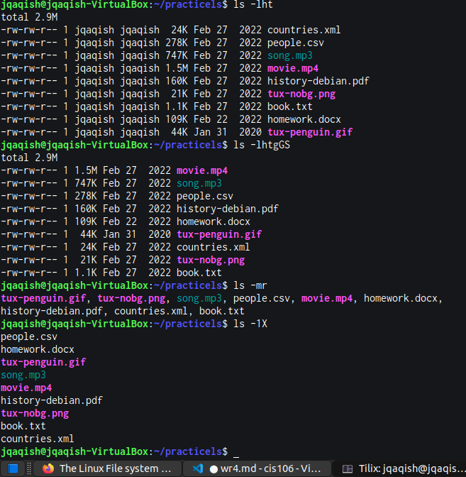
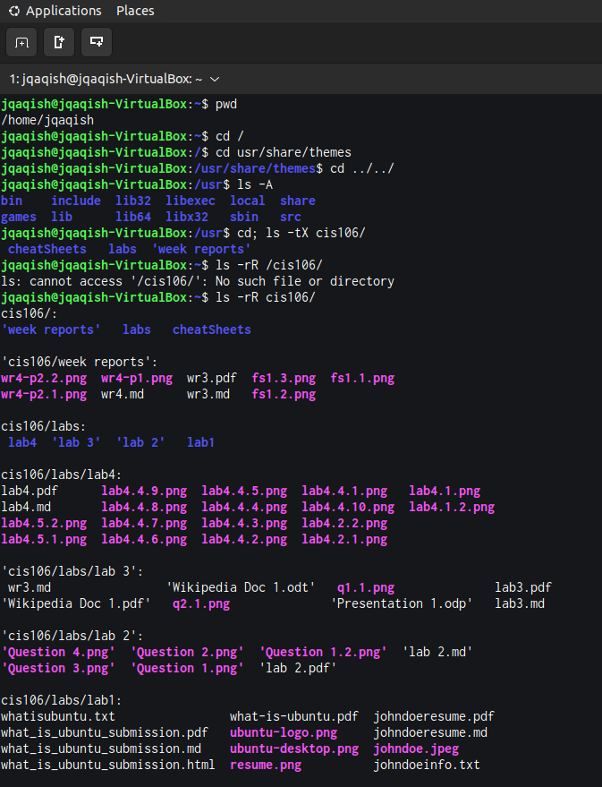
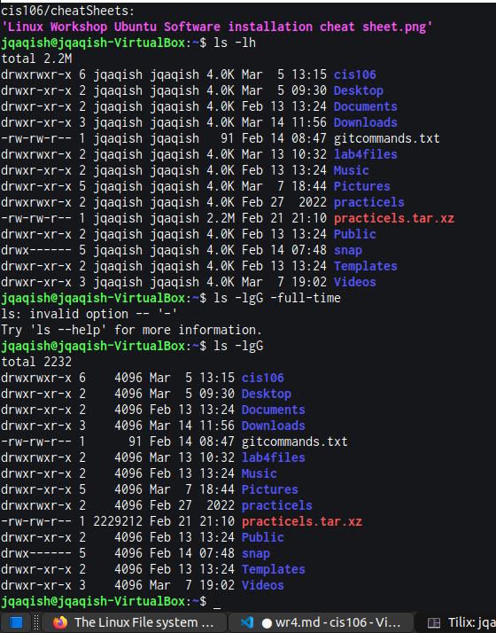
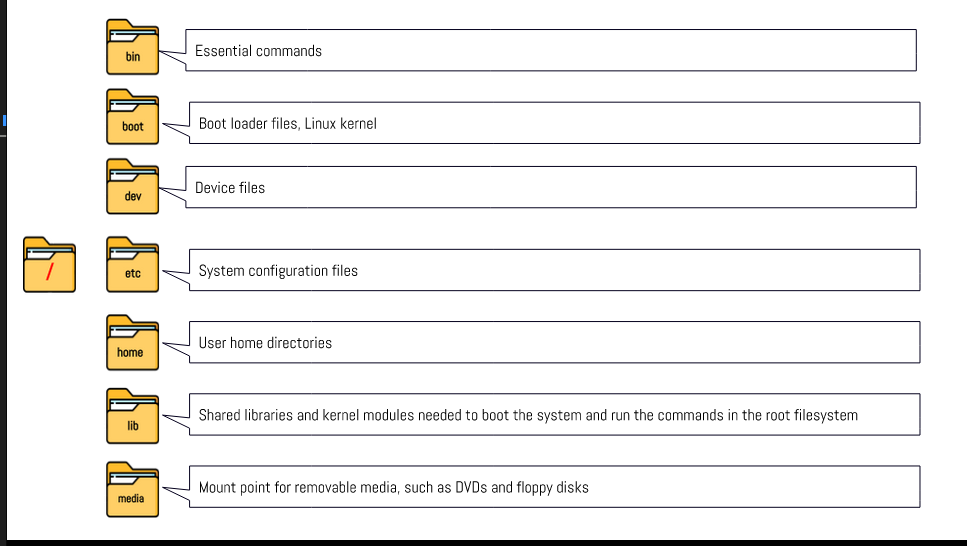
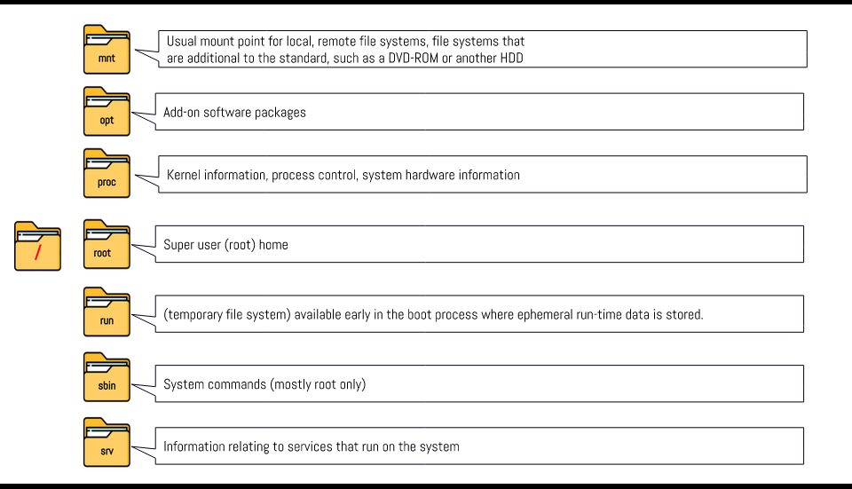
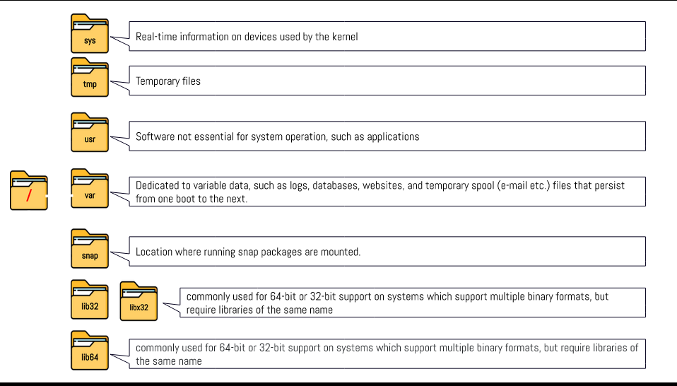

# Weekly Report 4

## Practice from the presentation The Linux File system:
### Practice 1:

### Practice 2:

### Practice 3:

## The Linux File system directories and their purpose:

## All the commands for navigating the filesystem

| Command | What it does               | Syntax | Example                  |
| ------- | -------------------------- | ------ | ------------------------ |
| pwd     | prints current directory   | pwd    | `pwd`                    |
| cd      | changes directory          | cd     | `cd /home/jqaqish/`      |
| ls      | lists files in a directory | ls     | `ls /share/backgrounds/` |
## Basic terminology
* **File system: The way files are stored and organized**
* **Current directory: The directory where you are at in the moment**
* **parent directory: A directory you can move forward to a subdirectory or backwards to the previous directory**
* **the difference between your home directory and the home directory: YOUR home directory is in your terminal, THE home directory is the default one. **
* **pathname: Something every file has, it indicates the location of the file in the filesystem.**
* **relative path: the location of a file starting from the current working directory or a directory that is located inside the current working directory.**
* **absolute path: the location of a file starting at the root of the file system**
